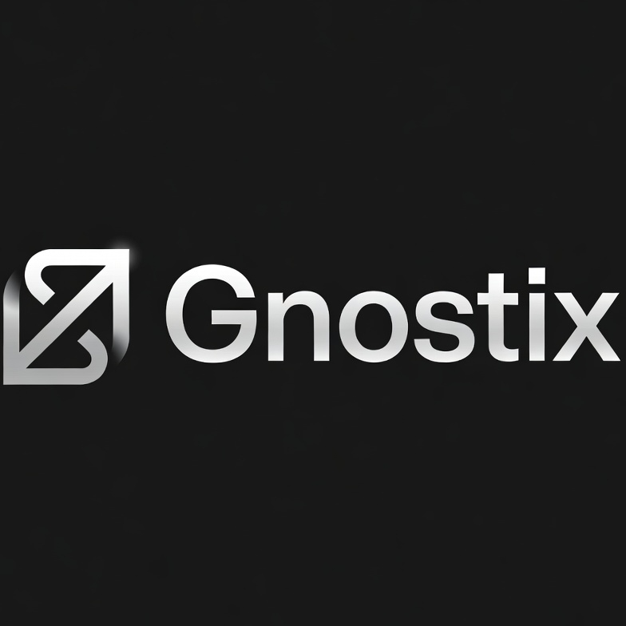

# Gnostix



A minimalist second brain for CEOs, managers, and knowledge workers. Upload business documents and get instant AI-powered summaries, key points, and action items — all organized in one elegant interface.

## Features

- **AI Summarization** — Extracts summaries, key points, and action items from any document
- **Multi-format support** — PDF, DOCX, TXT, and Markdown
- **Folders** — Organize documents into color-coded folders
- **Favorites** — Star important documents for quick access
- **Search** — Real-time full-text search across all documents
- **Export** — Copy or download summaries as Markdown

## Tech Stack

- [Next.js 15](https://nextjs.org/) (App Router)
- [Tailwind CSS v4](https://tailwindcss.com/)
- [Prisma 7](https://www.prisma.io/) + [Turso (libSQL)](https://turso.tech/)
- [Radix UI](https://www.radix-ui.com/) — accessible primitives
- [Google Gemini](https://ai.google.dev/) or [Ollama](https://ollama.com/) for AI

## Getting Started

### 1. Clone and install

```bash
git clone https://github.com/YOUR_USERNAME/gnostix.git
cd gnostix
npm install
```

### 2. Configure environment

```bash
cp .env.example .env.local
```

Edit `.env.local` with your values (see [Environment Variables](#environment-variables) below).

### 3. Set up the database

```bash
npm run db:migrate
npm run db:generate
```

### 4. Run locally

```bash
npm run dev
```

Open [http://localhost:3000](http://localhost:3000).

## Environment Variables

| Variable | Description | Required |
|---|---|---|
| `AI_PROVIDER` | `gemini` or `ollama` | Yes |
| `GEMINI_API_KEY` | API key from [Google AI Studio](https://aistudio.google.com/) | If using Gemini |
| `DATABASE_URL` | Turso/libSQL connection URL | Yes |
| `OLLAMA_BASE_URL` | Ollama server URL (default: `http://localhost:11434`) | If using Ollama |
| `OLLAMA_MODEL` | Ollama model name (e.g. `llama3.2:3b`) | If using Ollama |
| `OLLAMA_NUM_CTX` | Context window size (default: `8192`) | If using Ollama |

See `.env.example` for a full template.

## Using Ollama (Local AI)

If you prefer to run AI locally without an API key, use [Ollama](https://ollama.com/).

### 1. Install Ollama

**macOS / Linux:**
```bash
curl -fsSL https://ollama.com/install.sh | sh
```

**Windows:** Download the installer from [ollama.com](https://ollama.com/download).

### 2. Pull a model

```bash
ollama pull llama3.2:3b       # Fast, lightweight (recommended for most machines)
ollama pull llama3.2:7b       # Better quality, requires more RAM
ollama pull mistral            # Good alternative
```

### 3. Start the Ollama server

```bash
ollama serve
```

By default it runs on `http://localhost:11434`. Set the following in your `.env.local`:

```env
AI_PROVIDER=ollama
OLLAMA_BASE_URL=http://localhost:11434
OLLAMA_MODEL=llama3.2:3b
OLLAMA_NUM_CTX=8192
```

> **Note:** Ollama must be running before you start Gnostix. Documents with lots of text may take longer to process depending on your hardware.

## Scripts

```bash
npm run dev          # Start development server
npm run build        # Build for production
npm run db:migrate   # Run database migrations
npm run db:generate  # Regenerate Prisma client
npm run db:studio    # Open Prisma Studio
```

## License

MIT
